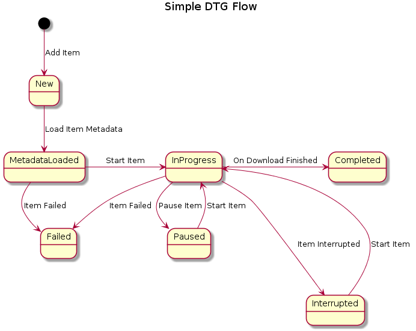
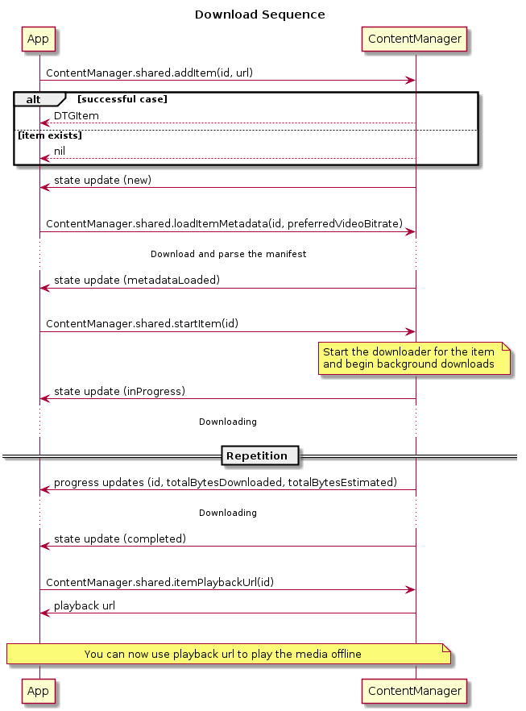
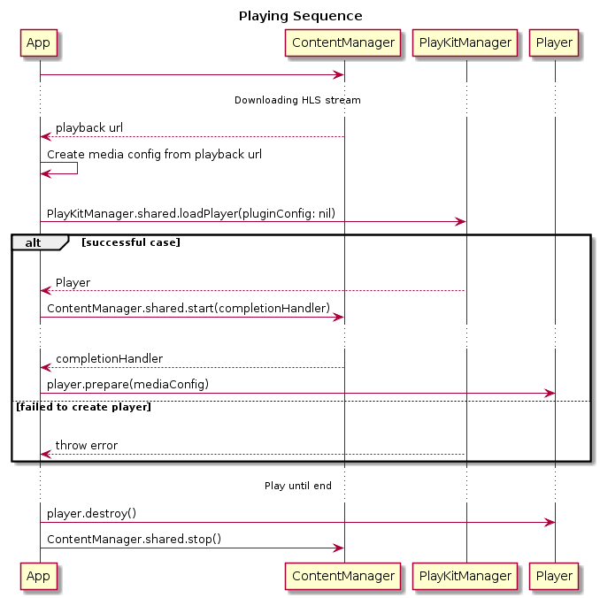

# Download-to-Go for iOS

Download to Go (DTG) is an iOS library that facilitates the download of HLS video assets.

## Supported Features 
- Downloading Kaltura HLS assets (Clear only)
- Background downloading.
- Resuming interrupted/paused downloads.

## Known Limitations
- No track selection (downloads all tracks)
- Can't play downloaded assets in background

## Installation

### [CocoaPods][cocoapods]

Add this to your podfile:
```ruby
pod 'DownloadToGo'
```

## Overview

### Simple Flow:



>Note: There is also `Removed` state which is not displayed here. `Removed` is a temporary state indicated an item was removed (can be considered as an event). You can remove an item from all states. 

### Download Sequence:



### Simple Playing Sequence (Using PlayKit Player):



## Usage

To use the DTG make sure to import in each source file:
```swift
import DownloadToGo
```

The following classes/interfaces are the public API of the library:
* `ContentManager` - Use this class to interact with the library.
* `DTGContentManager` - This is the main api you will use to interact with the library.
* `ContentManagerDelegate` - Delegate calls available to observe.
* `DTGItem` - Represent a single download item.
* `DTGItemState` - The state of a download item.

Basic Implementation:
```swift
class DownloadManager: ContentManagerDelegate {

    let cm: DTGContentManager

    init() {
        // setup content manager and delegate
        cm = ContentManager.shared
        cm.delegate = self
    }

    func downloadItem(id: String, url: URL) {
        _ = cm.addItem(id: id, url: url) // make sure the item was added
        do {
            try cm.loadItemMetadata(id: self.selectedItem.id, preferredVideoBitrate: 300000)    {
                // metadata loaded
                try cm.startItem(id: self.selectedItem.id)
            }
        } catch {
            // handle errors
        }
    }

    func playbackUrl(id: String) -> URL? {
        do {
            return try downloadManager.itemPlaybackUrl(id: id)
        } catch {
            // handle errors
            return nil
        }
    }

    func item(id: String, didDownloadData totalBytesDownloaded: Int64, totalBytesEstimated: Int64?) {
        // handle progress updates
    }

    func item(id: String, didChangeToState newState: DTGItemState, error: Error?) {
        // handle state changes (metadataLoaded, inProgress, completed etc...)
    }
}
```

Basic Implementation with PlayKit:
```swift
class VideoViewController: UIViewController {

    let downloadManager = DownloadManager()
    var player: Player?
    @IBOutlet weak var playerView: PlayerView!

    override func viewDidLoad() {
        super.viewDidLoad()
        do {
            let player = try PlayKitManager.shared.loadPlayer(pluginConfig: nil)
            self.player = player
            player.view = self.playerView

            if let localUrl = downloadManager.playbackUrl(id: "myLocalId") {
                let mediaEntry = localAssetsManager.createLocalMediaEntry(for: "myLocalId", localURL: localUrl)
                player.prepare(MediaConfig(mediaEntry: mediaEntry))
                // you can now call prepare when you want (in case no error)
            }
        } catch {
            // handle errors
        }
    }
}
```


[cocoapods]: https://cocoapods.org/
